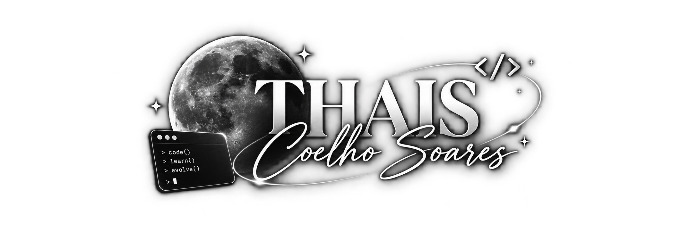

<!-- ============================================================ -->
<!--              THAIS COELHO // GITHUB COMMAND CENTER          -->
<!-- ============================================================ -->

<div align="center">

  <!-- ====================== HERO ====================== -->

  

  <br>
  <br>

  <!-- ================= TYPESCRIPT BOOT ================= -->

  

  <br>

  

  <br>
  <br>

  <h1>⚡ THAIS COELHO</h1>

  <p>
    <strong>CENTRAL DE COMANDO</strong>
  </p>

  <p>
    <code>COMPUTER SCIENCE</code>
    &nbsp; // &nbsp;
    <code>FULL-STACK</code>
    &nbsp; // &nbsp;
    <code>CYBERSECURITY</code>
  </p>

</div>

<br>

<!-- ============================================================ -->
<!--                     SYSTEM STATUS                            -->
<!-- ============================================================ -->

<table>
<tr>

<td width="35%" valign="top">

### `> SYSTEM_STATUS.exe`

```text
╭──────────────────────────────╮
│                              │
│  ● SYSTEM_ONLINE             │
│                              │
│  CORE        ACTIVE          │
│  NETWORK     CONNECTED       │
│  SECURITY    ACTIVE          │
│  DEVELOPMENT RUNNING         │
│                              │
│  LOCATION                    │
│  └─ Brazil 🇧🇷               │
│                              │
╰──────────────────────────────╯
<br>

<!-- ============================================================ -->
<!--                 SYSTEM INFORMATION                          -->
<!-- ============================================================ -->

<div align="center">


</div>

<br>

<!-- ============================================================ -->
<!--                      ABOUT + FOCUS                           -->
<!-- ============================================================ -->

<table>
<tr>

<td width="50%" valign="top">

## 🧠 ABOUT_ME

```text
╭────────────────────────────╮
│                            │
│  USER: THAIS_COELHO        │
│                            │
│  Computer Science          │
│  Full-Stack Developer      │
│  CyberSecurity Enthusiast  │
│                            │
│  STATUS: LEARNING          │
│                            │
╰────────────────────────────╯
