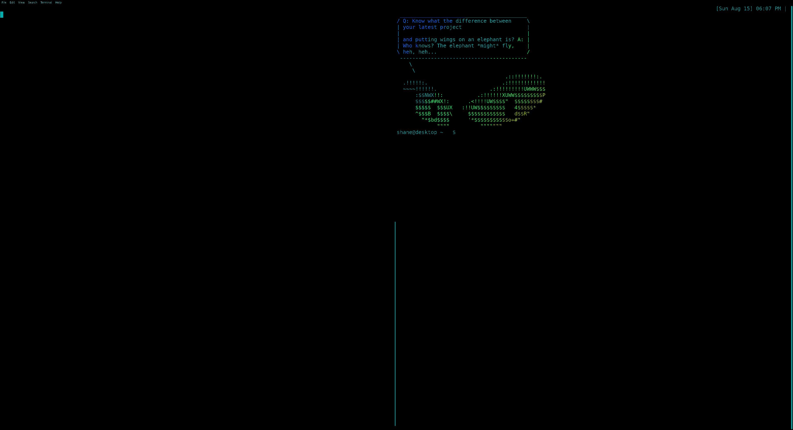
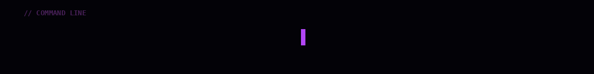
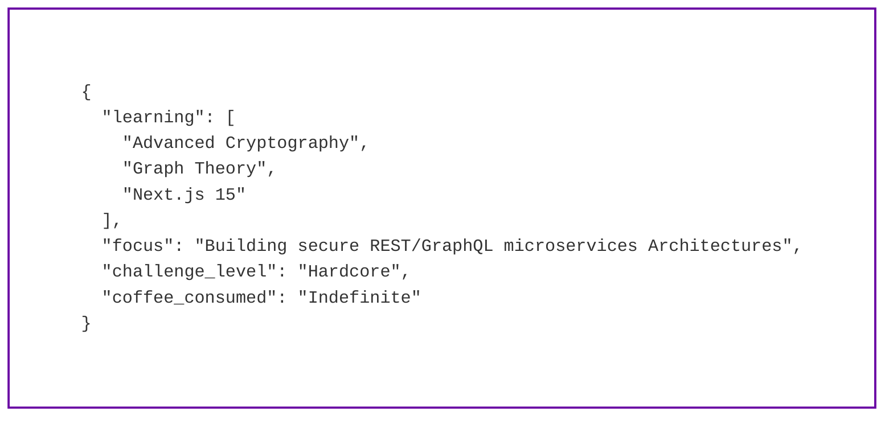

<!-- ============================================================ -->

<!--              THAIS COELHO // COMMAND CENTER                 -->

<!-- ============================================================ -->

<div align="center">

  <!-- ======================== HERO =========================== -->



  <br>

  <!-- ================= TERMINAL PHRASES ===================== -->



<br><br>

  <!-- ================= IDENTITY ============================== -->

  <h1 align="center">
     𝙏𝙃𝘼𝙄𝙎 𝘾𝙊𝙀𝙇𝙃𝙊 SOARES
  </h1>

  <h2 align="center">
     CIENTISTA DA COMPUTAÇÃO // CENTRAL DE COMANDO
  </h2>

  <p align="center">
    <code>COMPUTER SCIENCE</code>
    &nbsp;//&nbsp;
    <code>FULL-STACK</code>
    &nbsp;//&nbsp;
    <code>CYBERSECURITY</code>
  </p>

  <br>

🌐 <strong>LINKEDIN</strong>
 | 
📸 <strong>INSTAGRAM</strong>

</div>

<br>

---

##  OVERVIEW // SOBRE MIM

🤖 Bem-vindo(a) à minha central de comando baseada na nuvem.

Sou estudante de **Ciência da Computação** apaixonada por decodificar problemas complexos, estruturar arquiteturas web eficientes e desvendar os meandros da segurança cibernética.

 Meu foco atual está no desenvolvimento de aplicações modernas de ponta a ponta (**Full-Stack**), automação de processos inteligentes e no estudo prático de vulnerabilidades digitais.

🛡️ Acredito que o código limpo combinado com protocolos de segurança rígidos é o que define o verdadeiro software de nível de produção.

### SYSTEM DATA

* 📍 **LOCALIZAÇÃO:** `BRASIL`
* 🚀 **STATUS:** `CODANDO O FUTURO`
* 🧠 **MODE:** `LEARNING`


---

##  TECH STACK & CORE PROTOCOLS

Aqui estão os módulos e tecnologias integrados ao meu ecossistema de desenvolvimento:

### 🛡️ CYBER SECURITY & AMBIENTE

<div align="center">


</div>

<br>

###  DESENVOLVIMENTO FULL-STACK

<div align="center">


</div>
---

## SYSTEM OBJECTIVES // DIÁRIO DE BORDO



---

## SYSTEM ARCHITECTURE
---

## SYSTEM ARCHITECTURE

```text
┌─────────────────────────────────────────────┐
│              THAIS COELHO                   │
│          COMMAND CENTER ONLINE              │
├─────────────────────────────────────────────┤
│                                             │
│   COMPUTER SCIENCE                          │
│          ↓                                  │
│   FULL-STACK DEVELOPMENT                    │
│          ↓                                  │
│   CYBERSECURITY                             │
│          ↓                                  │
│   SECURE SYSTEMS                            │
│                                             │
└─────────────────────────────────────────────┘
```

---

<div align="center">

###  SYSTEM STATUS: ONLINE

`BUILDING` // `LEARNING` // `BREAKING` // `REBUILDING`

</div>
